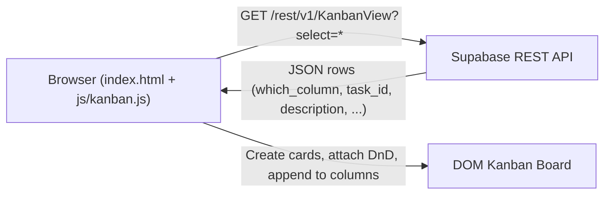

# Supabase-backed Kanban (Phase 1)

## Goal

- **Replace hardcoded cards** in the current Kanban wireframe with data coming from your Supabase `KanbanView` REST endpoint.
- **Read-only for now**: on page load, fetch rows and render them into the correct column based on `which_column` (`"To Do"`, `"In Progress"`, `"Done"`).
- **Keep current UX**: maintain the existing layout and drag-and-drop behavior, but dragging will not update the database yet.

## Data model and REST API

- **View definition** (from `[c:\Users\chuda\source\repos\Kanban Wireframe\sql\Create Views.sql](c:\Users\chuda\source\repos\Kanban Wireframe\sql\Create Views.sql)`):
  - View: `public.KanbanView`.
  - Important columns for the board:
    - `which_column` (text) – maps to Kanban column: `"To Do"`, `"In Progress"`, `"Done"`.
    - `task_id` (primary key for the card row).
    - `description` – main task text to show on the card.
    - Optional extra display fields you might want: `assigned_to`, `category`, `status`, `due_date`.
- **REST endpoint shape** (Supabase standard):
  - URL: `https://<your-project>.supabase.co/rest/v1/KanbanView?select=`*.
  - Headers:
    - `apikey: <your-anon-key>`.
    - `Authorization: Bearer <your-anon-key>`.
    - `Content-Type: application/json` (not strictly required for GET).
- **Mapping logic**:
  - If `which_column === "To Do"` → goes to the To Do column.
  - If `which_column === "In Progress"` → goes to the In Progress column.
  - If `which_column === "Done"` → goes to the Done column.
  - Any unexpected value can default to To Do or be skipped (we’ll document a simple default in code comments and implementation).

## Front-end architecture

### HTML adjustments (`index.html`)

- File: `[c:\Users\chuda\source\repos\Kanban Wireframe\index.html](c:\Users\chuda\source\repos\Kanban Wireframe\index.html)`.
- **Tag columns with data attributes** so JS can reliably target them:
  - To Do: `<section class="column" data-column="To Do">`.
  - In Progress: `<section class="column" data-column="In Progress">`.
  - Done: `<section class="column" data-column="Done">`.
- **Remove hardcoded cards** inside each column body, leaving only the `<h2>` headers so the board starts empty and is fully driven by Supabase data.
- Keep the existing `` at the bottom of the body.

### Styling (CSS) considerations (`css/style.css`)

- File: `[c:\Users\chuda\source\repos\Kanban Wireframe\css\style.css](c:\Users\chuda\source\repos\Kanban Wireframe\css\style.css)`.
- Existing layout and card styles already work for dynamic content:
  - `.board` flex layout, `.column` panels, `.card` visual style, drag states.
- No major changes required for Phase 1; only ensure:
  - Empty columns still look fine (maybe keep a minimum height or padding which they already have).
  - Drag styles (`.card.dragging`, `.column.drag-over`) remain intact.

### JavaScript changes (`js/kanban.js`)

- File: `[c:\Users\chuda\source\repos\Kanban Wireframe\js\kanban.js](c:\Users\chuda\source\repos\Kanban Wireframe\js\kanban.js)`.
- **1. Add Supabase config constants** at the top:
  - `SUPABASE_URL` – your project base URL.
  - `SUPABASE_ANON_KEY` – your anon public key.
  - `KANBAN_VIEW` – `'KanbanView'`.
  - Note in code comments that these are public client-side keys and should be anon-level only.
- **2. Refactor drag-and-drop logic into reusable functions** so it works with dynamically created cards:
  - Extract current event binding into functions like:
    - `attachCardDnD(card, columnsNodeList)` – attaches `dragstart`, `dragend`, `dragover`, `drop` to a single card element.
    - `attachColumnDnD(column)` – keeps existing column `dragover` / `dragleave` / `drop` handlers.
  - Ensure these functions can be called after cards are created from fetched data (no reliance on initial `querySelectorAll('.card')` at load time only).
- **3. Add fetch + render flow**:
  - On `DOMContentLoaded`, do:
    - Query all columns once: `document.querySelectorAll('.column')` and build a mapping from `data-column` value to column element.
    - Call `loadCardsFromSupabase()`.
  - `loadCardsFromSupabase()`:
    - Uses `fetch` against `SUPABASE_URL + '/rest/v1/' + KANBAN_VIEW + '?select=*'` with appropriate headers.
    - Parses JSON into an array of rows.
    - Calls `renderKanbanBoard(rows, columnsByKey)`.
  - `renderKanbanBoard(rows, columnsByKey)`:
    - Clears any existing cards from each column (if needed).
    - For each row:
      - Determine column key: `row.which_column` (fallback to `'To Do'` if unexpected).
      - Look up the matching column via `columnsByKey[row.which_column]`; if missing, use the To Do column or skip.
      - Create a new `div` element:
        - `className = 'card'`.
        - `draggable = true`.
        - `dataset.taskId = row.task_id` (so we can identify it later when persisting moves in a later phase).
        - Inner structure: simple `<h3>` from `row.description` (or a truncated version) and optionally a small `
` combining `assigned_to` and `category`.
      - Append the card to the target column.
      - Call `attachCardDnD` to wire drag events for that card.
- **4. Simple loading/error handling (optional but recommended)**:
  - Before fetch, show a minimal loading indicator (e.g. a text node at the top of each column or under the header).
  - On successful render, remove it.
  - On error, log to console and optionally show a small error message in the header or inside each column (no need for anything fancy in Phase 1).

## Data flow overview

## Implementation steps summary

1. **Tag columns and remove static cards**
  - Edit `index.html` to add `data-column` attributes to each column section and delete the hardcoded `.card` divs.
2. **Wire Supabase config & fetch**
  - Add Supabase URL/key constants and a `loadCardsFromSupabase()` function in `js/kanban.js` that fetches from `KanbanView` and converts rows to an in-memory array.
3. **Render dynamic cards**
  - Implement `renderKanbanBoard(rows, columnsByKey)` to create `.card` elements, set `draggable="true"`, and append them to the right column based on `which_column`.
4. **Make drag-and-drop work with dynamic content**
  - Refactor existing DnD logic in `js/kanban.js` into reusable functions and call them after creating each card and when initializing columns.
5. **Test end-to-end**
  - Open `index.html` in the browser.
  - Verify:
    - Cards populate from Supabase and appear under the correct columns.
    - Dragging cards between columns works visually (but does not persist to the DB yet).
    - Error handling is acceptable when the API key or URL is invalid (e.g. console message, minimal on-page message).

