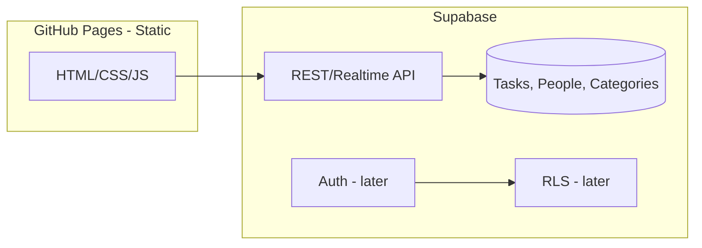

# Kanban To-Do List Helper – Implementation Plan

## Current state

- **Schema** (in [sql/](sql/)): `Tasks` (description, due_date, assigned_to → People, category_id → Categories), `People`, `Categories`. No Supabase client or app logic in the repo yet.
- **App**: [index.html](index.html) and [css/style.css](css/style.css) are a minimal “Hello World” with no JavaScript.
- **Hosting**: GitHub Pages (static only; no server-side code).
- **Reference**: [for reference/readme.md](for reference/readme.md) describes the broader vision (calendar, friends, security, reminders, themes).

---

## Architecture (high level)

- **Front end**: Static HTML/CSS/JS served from GitHub Pages. All logic in the browser (no backend except Supabase).
- **Data**: Supabase project with your existing tables; front end uses Supabase JS client (CDN or npm) to read/write via REST (and optionally Realtime).
- **Later**: Supabase Auth + Row Level Security (RLS) when “assign to friends” and multi-user security matter.

---

## Phase 1: Kanban board (first UI)

**Goal**: Single-user personal Kanban: columns = categories, cards = tasks. **Anon access at first** (Supabase anon key; no auth until Phase 2).

### 1.1 Tech: plain HTML and JS only

- **No frameworks** (no React, Vue, etc.). Plain HTML, CSS, and JavaScript only.
- No build step: open `index.html` locally or serve via GitHub Pages. Supabase via CDN: ``.
- You already have a Supabase project; use its Project URL and anon public key.

### 1.2 Mapping your schema to Kanban

- **Columns**: Use **Categories** as Kanban columns. Seed at least three categories, e.g. “To Do”, “In Progress”, “Done” (and optionally more). Use `category_type` later to distinguish “board column” vs other category types if needed.
- **Cards**: **Tasks**; each task’s `category_id` determines which column it appears in. Show `description`, `due_date`, and optionally `assigned_to` (display only until People/friends UI exists).
- **Order in column**: Schema has no `position`/`sort_order`. Options: (a) show tasks in a simple order (e.g. `created_at` or `id`) for now; (b) add a column like `position integer` or `sort_order` later for drag-and-drop reordering.

### 1.3 Schema tweaks (agreed)

- **Drop `Tasks.description` UNIQUE**: So the student can have duplicate task text (e.g. two “Buy milk” tasks). Run `ALTER TABLE public."Tasks" DROP CONSTRAINT "Tasks_description_key";` in Supabase SQL editor.
- **Optional – column order**: Add `position integer DEFAULT 0` to `Tasks` when you want drag-and-drop order persisted; otherwise show tasks by `created_at` or `id`.

### 1.4 Implementation steps (Phase 1)

1. **Supabase project** (you already have one)
  - Ensure schema is applied: `Create Categories.sql`, `Create People.sql`, `Create Tasks.sql`; then drop `Tasks_description_key` (see 1.3).
  - Seed 3 categories: “To Do”, “In Progress”, “Done”.
  - In Dashboard: Project Settings → API: copy **Project URL** and **anon public** key for the front end.
2. **Repo setup**
  - Keep config out of git: e.g. a `config.js` that reads from `window.SUPABASE_URL` / `window.SUPABASE_ANON_KEY` set in a non-committed file, or use a single `supabaseConfig.js` that you add to `.gitignore` and document in README (students paste their keys locally). For GitHub Pages, use Supabase “URL + anon key” in a small inline or build-time config so the static site can talk to Supabase (anon key is public by design; security later = Auth + RLS).
3. **Kanban UI**
  - **HTML**: One container for the board; per column, a column div; per task, a card div (description, due date, maybe assigned_to placeholder).
  - **CSS**: Columns side-by-side (flexbox/grid); cards with clear hierarchy; basic responsive behavior so it works on phones (reference readme).
  - **JS**:
    - Init Supabase client with URL + anon key.
    - Fetch categories (order by name or by a new `sort_order` if you add it) → render column headers.
    - Fetch tasks (with `category_id`); group by `category_id` and render cards in the right columns.
    - “Add task”: form or button → insert row in `Tasks` with chosen `category_id` (e.g. “To Do”) → refresh or optimistically update board.
    - “Move card”: change task’s `category_id` (e.g. dropdown or “next column” button); optional: drag-and-drop later with `position` if you add it.
    - “Delete task” and “Edit task” (e.g. description, due_date) as simple operations that update/delete in Supabase and re-render.
4. **GitHub Pages**
  - Enable Pages for the repo (e.g. branch `main`, folder `/` or `/docs` if you put the site in `docs`).
  - Ensure the site uses HTTPS and that the Supabase project allows requests from the GitHub Pages origin (Supabase allows all by default; later with auth you’ll add the site URL to Supabase “Redirect URLs” if using login).

---

## Phase 2: Security and “assign to friends”

When the student is ready:

- **Supabase Auth**: Sign up / sign in (email+password or magic link). No server code needed; all in the browser.
- **RLS**: Define policies so that:
  - A user sees only tasks they “own” or are assigned to (or that belong to a shared group, depending on how you model “friends”).
  - Only authenticated users can insert/update/delete tasks; optionally restrict which users can assign to which friends.
- **Linking app users to People**: Add a table or column linking Supabase `auth.users` to `People` (e.g. `People.auth_user_id uuid REFERENCES auth.users(id)`), so “assign to friends” uses the same People row and RLS can allow assignment only to friends.

This phase does not change the Kanban UI flow; it only adds login and RLS so that multi-user and “assign to friends” are safe.

---

## Phase 3: Admin UIs (categories, friends)

- **Categories admin**: Simple CRUD UI (list categories, add, edit name/description, delete) calling Supabase on `Categories`. Protects writes with RLS (e.g. only authenticated user or “admin” can change categories).
- **Friends (People) admin**: CRUD for `People` (first_name, last_name, short_name, email_address, etc.). When Auth exists, link “friends” to accounts via `People.auth_user_id` so “assigned_to” in the Kanban is meaningful and RLS can restrict assignment to that list.

Keep these as separate plain HTML pages (e.g. `admin-categories.html`, `admin-friends.html`) with their own JS, same no-framework approach.

---

## Suggested file layout (Phase 1)

- `index.html` – Kanban board (columns + cards).
- `css/style.css` – Global + Kanban layout and cards.
- `js/supabase-config.js` – Supabase client init (URL + anon key; file or values not committed if you want to avoid leaking project URL in public repos; document for students).
- `js/kanban.js` – Fetch categories/tasks, render board, add/move/edit/delete task.

Later: `admin-categories.html`, `admin-friends.html`, and corresponding JS; optional `js/auth.js` for login/logout when you add Phase 2.

---

## Summary

| Item             | Approach                                                                           |
| ---------------- | ---------------------------------------------------------------------------------- |
| First UI         | Kanban board: columns = Categories, cards = Tasks                                  |
| Schema           | Drop `Tasks.description` UNIQUE; optionally add `position` for drag-and-drop later |
| Stack            | Plain HTML + CSS + JS only; Supabase JS via CDN; GitHub Pages                      |
| Security (later) | Supabase Auth + RLS; link `People` to `auth.users` for “friends”                   |
| Admin (later)    | Separate pages or routes for Categories and People CRUD                            |

This gets the student to a working personal Kanban quickly, keeps the path to “assign to friends” and admin UIs clear, and stays within “static site + Supabase” so everything works on GitHub Pages with no backend server.